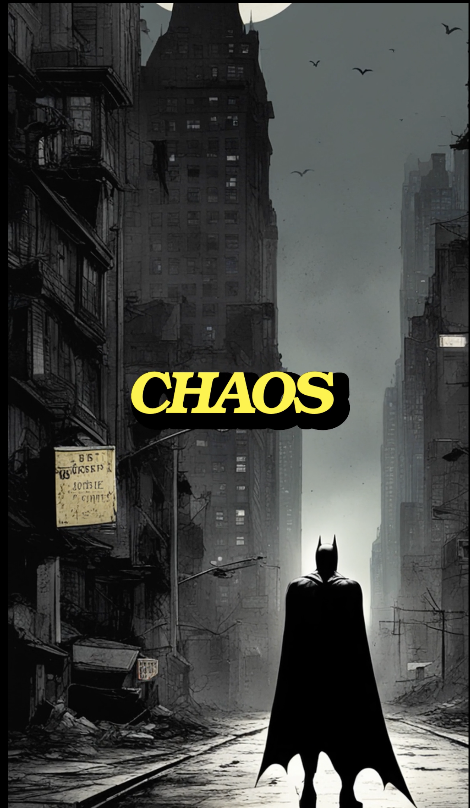

# Text To Video Script
Text To Video Script To generate short form videos for TikTok and YouTube Shorts.
It generates voiceover audio using AWS Polly and Subtitles with the moviepy. Story is generated with ChatGPT prompts

# Install and Run
```
pip3 install -r requirements.txt
cp .env.example .env
// fill in OPENAI keys, AWS keys, and replicate keys
python3 text-to-video-bot.py
```

# Demo
[Demo link](https://www.youtube.com/shorts/8fdNap5Fd-8?feature=share)




